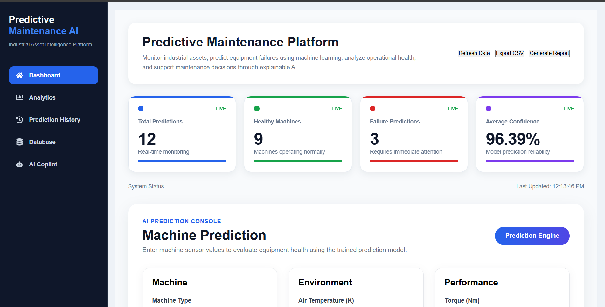
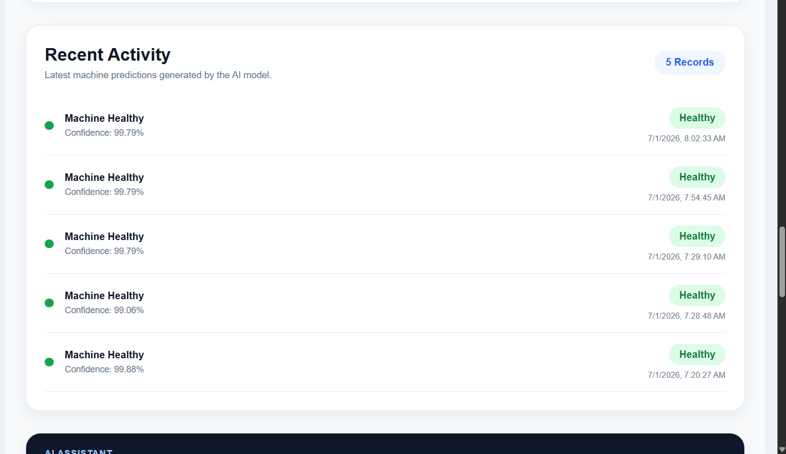
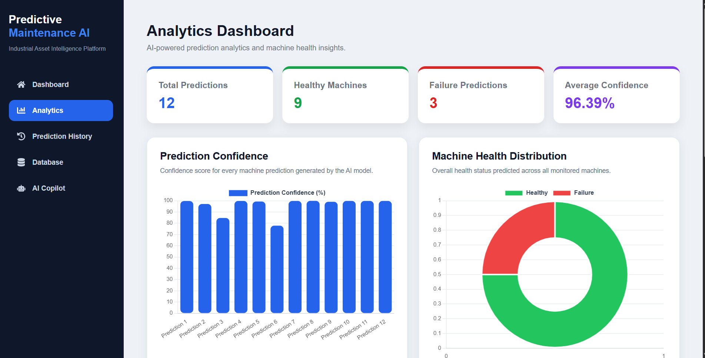
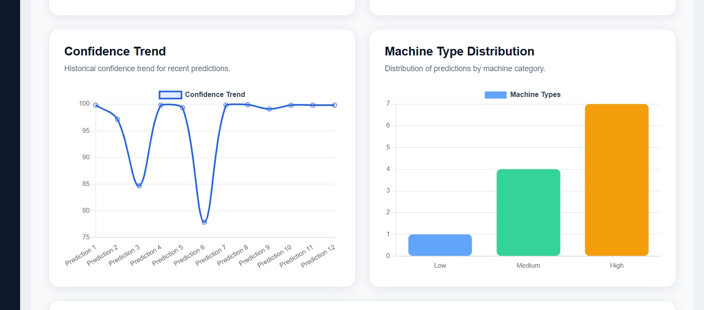
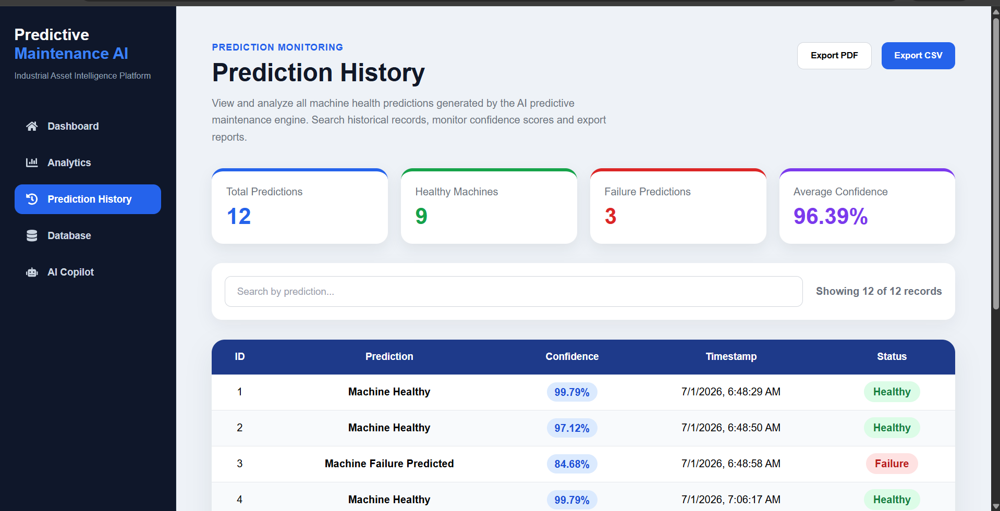
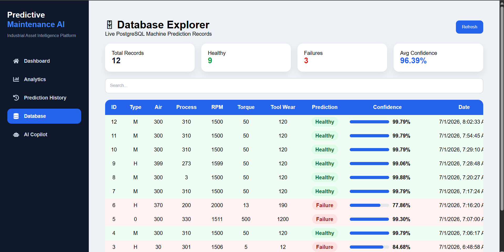
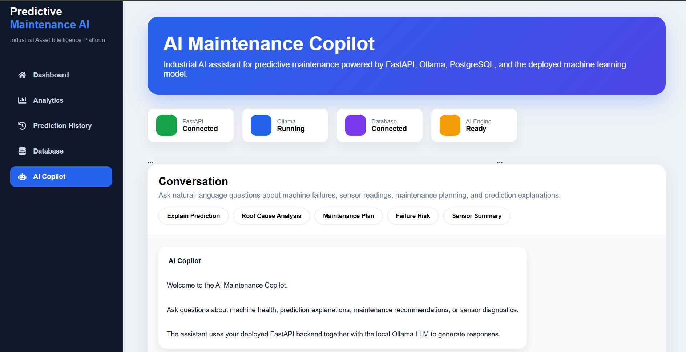
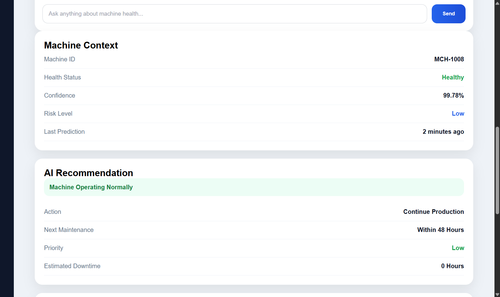
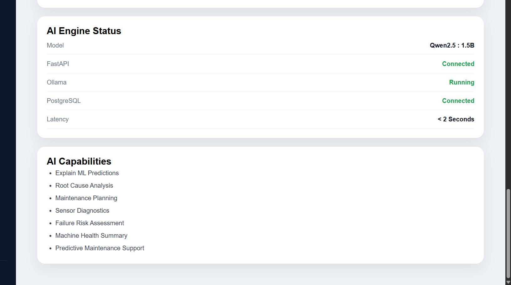

# 🏭 Predictive Maintenance & Asset Intelligence Platform

### AI-Powered Industrial Predictive Maintenance System

An end-to-end AI-powered predictive maintenance platform that predicts machine failures, explains model decisions using SHAP, streams prediction events with Apache Kafka, stores prediction history in PostgreSQL, and provides an interactive React dashboard with an AI Maintenance Copilot.

---

## 📸 Demo



---

## 📖 Project Overview

Modern manufacturing systems generate thousands of sensor readings every minute. Unexpected equipment failures lead to production downtime, increased maintenance costs, and reduced operational efficiency.

This project uses **Machine Learning** and **Explainable AI** to predict machine failures before they occur and provide maintenance recommendations based on sensor data.

---

## ✨ Features

### 🔧 Machine Failure Prediction
- Predicts machine health using an **XGBoost** classification model
- Calculates prediction confidence scores
- Generates real-time maintenance recommendations

### 🔍 Explainable AI (SHAP)
- Explains every prediction using SHAP values
- Displays feature importance rankings
- Identifies which sensor values contributed most to the prediction

### 🤖 AI Maintenance Copilot
- Natural language assistant powered by **Ollama (Qwen 2.5)**
- Explains prediction results
- Provides maintenance recommendations
- Answers engineering questions

### ⚡ Real-Time Event Streaming
- Kafka Producer publishes prediction events
- Kafka Consumer processes prediction events
- Supports scalable industrial data pipelines

### 🗄️ Prediction History
- Stores every prediction in PostgreSQL
- Displays historical prediction records
- Supports CSV export and PDF report generation

### 📊 Interactive Dashboard
- Machine prediction console
- Analytics dashboard
- Prediction history
- Health indicators
- Recent activity feed
- AI Copilot chat interface

---

## 🏗️ System Architecture

```
Sensor Data
      │
      ▼
 React Dashboard
      │
      ▼
 FastAPI Backend
      │
 ┌────┴─────────────┐
 ▼                   ▼
XGBoost Model     PostgreSQL
 │                   │
 ▼                   ▼
 SHAP           Prediction History
 │
 ▼
 Kafka Producer
 │
 ▼
 Kafka Topic
 │
 ▼
 Kafka Consumer
 │
 ▼
 AI Maintenance Copilot
```

---

## 🛠️ Technology Stack

| Layer | Technologies |
|---|---|
| **Frontend** | React, React Router, Axios, Chart.js, React ChartJS, React Toastify |
| **Backend** | FastAPI, Uvicorn, SQLAlchemy, Pydantic |
| **Machine Learning** | XGBoost, Scikit-Learn, Pandas, NumPy, SHAP |
| **Database** | PostgreSQL |
| **Event Streaming** | Apache Kafka, Kafka Python |
| **AI** | Ollama, Qwen 2.5 |
| **Deployment** | Docker, Docker Compose |

---

## 📁 Folder Structure

```
Predictive-maintenance/
│
├── api/              # FastAPI backend
├── frontend/         # React dashboard
├── ml/               # Model training & artifacts
├── event_stream/     # Kafka producer/consumer
├── data/             # Datasets
├── docker/           # Docker configs
├── monitoring/       # Monitoring setup
├── spark/            # Spark jobs (if applicable)
├── scripts/          # Utility scripts
├── notebooks/        # Jupyter notebooks
├── tests/            # Test suite
├── notes/            # Project notes
├── docker-compose.yml
└── README.md
```

---

## 🧠 Machine Learning Pipeline

```
Dataset
   ↓
Preprocessing
   ↓
Feature Engineering
   ↓
Train/Test Split
   ↓
XGBoost Training
   ↓
Model Evaluation
   ↓
Model Serialization
   ↓
FastAPI Deployment
   ↓
SHAP Explainability
```

---

## 🔌 API Endpoints

| Method | Endpoint | Description |
|---|---|---|
| `GET` | `/` | API Status |
| `POST` | `/predict` | Machine Failure Prediction |
| `POST` | `/explain` | SHAP Explanation |
| `POST` | `/copilot` | AI Maintenance Copilot |
| `GET` | `/predictions` | Prediction History |

---

## 🖥️ Dashboard Modules

- Dashboard
- Prediction Console
- Analytics
- Health Indicators
- Prediction History
- AI Maintenance Copilot
- Recent Activity



---

## 🎯 Sample Prediction

**Input**

| Parameter | Value |
|---|---|
| Machine Type | High |
| Air Temperature | 300 K |
| Process Temperature | 310 K |
| RPM | 1500 |
| Torque | 50 Nm |
| Tool Wear | 120 min |

**Prediction**

- **Result:** Machine Healthy
- **Confidence:** 99.79%

**Top SHAP Features**
1. Torque
2. Tool Wear
3. Process Temperature

---

## 📈 Analytics Dashboard

| Metric | Value |
|---|---|
| Model Accuracy | 98.75% |
| Prediction Confidence | 99%+ |
| Explainability | SHAP Feature Importance |
| Database | Prediction History Stored |
| Streaming | Apache Kafka Integration |




---

## 📜 Prediction History



---

## 🗄️ Database Explorer

Live PostgreSQL records of every prediction, browsable and searchable.



---

## 🤖 AI Copilot in Action








---

## 🚀 Getting Started

### Prerequisites
- Python 3.10+
- Node.js 18+
- Docker & Docker Compose
- PostgreSQL

### Installation

```bash
# Clone the repository
git clone https://github.com/sejalr28/predictive-maintenance-platform.git
cd predictive-maintenance

# Start all services with Docker Compose
docker-compose up --build
```

### Manual Setup

```bash
# Backend
cd api
pip install -r requirements.txt
uvicorn main:app --reload

# Frontend
cd frontend
npm install
npm start
```

---

## 🔮 Future Improvements

- ☁️ Cloud Deployment
- 📡 Real-time IoT Sensor Integration
- 🔐 Role-based Authentication
- 🏭 Multi-machine Monitoring
- 🗓️ Predictive Maintenance Scheduling

---

## 👩‍💻 Author

**Sejal Rane**
AI • Machine Learning • Data Science • Data Engineering


